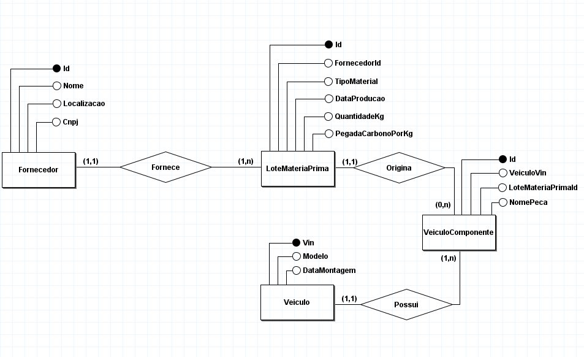
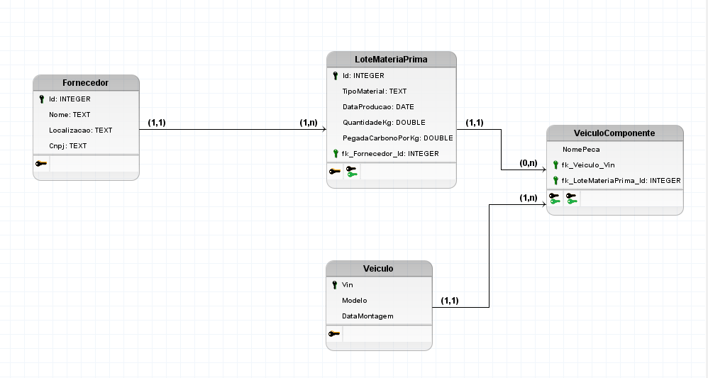

# Implementacao do MVVM no Projeto Iveco
Repositório criado para a realização documentação da implementação do MVVM ao nosso  projeto da iveco

# 🚛 Documentação do Banco de Dados: Cadeia de Suprimentos e Veículos

Bem-vindo à documentação do esquema de banco de dados desenvolvido para o gerenciamento e rastreabilidade da cadeia de suprimentos de veículos. Este modelo permite o controle de fornecedores, lotes de matérias-primas (incluindo o monitoramento da pegada de carbono), registro de veículos e a associação exata de quais componentes e lotes compõem cada veículo.

## 📑 Índice
- [Visão Geral](#visao-geral)
- [Diagramas](#diagramas)
- [Dicionário de Dados](#dicionario-de-dados)
- [Relacionamentos](#relacionamentos)
- [Script SQL (SQLite)](#script-sql-sqlite)
- [Estrutura de Diretórios](#estrutura-de-diretorio)
---

## 🎯 Visão Geral

O sistema é composto por 4 entidades principais, estruturadas para suportar um banco de dados relacional (focado em SQLite):
1. **Fornecedor**: Gerencia os dados das empresas que fornecem os materiais.
2. **LoteMateriaPrima**: Registra as entradas de materiais, quantidades e métricas ambientais (pegada de carbono).
3. **Veiculo**: Cadastro dos veículos produzidos/montados.
4. **VeiculoComponente**: Tabela associativa que rastreia qual peça exata, originada de qual lote de matéria-prima, foi instalada em um veículo específico.

---

## 📊 Diagramas

Para facilitar o entendimento da arquitetura, consulte os diagramas abaixo que representam as fases de modelagem.

### Modelo Conceitual (MER)
Representação de alto nível das entidades, atributos e suas cardinalidades.



### Modelo Lógico/Relacional
Estrutura de tabelas, chaves primárias (PK) e chaves estrangeiras (FK).



---

## 🗄️ Dicionário de Dados

Abaixo está o detalhamento técnico de cada tabela e seus respectivos campos.

### 1. Tabela `Fornecedor`
Armazena as informações das empresas fornecedoras de matérias-primas.

| Coluna | Tipo | Restrições | Descrição |
| :--- | :--- | :--- | :--- |
| `Id` | `INTEGER` | `PRIMARY KEY, AUTOINCREMENT` | Identificador único do fornecedor. |
| `Nome` | `VARCHAR(255)` | `NOT NULL` | Razão social ou nome fantasia do fornecedor. |
| `Cnpj` | `VARCHAR(18)` | `NOT NULL, UNIQUE` | Cadastro Nacional da Pessoa Jurídica (ex: 00.000.000/0000-00). |
| `Localizacao` | `VARCHAR(255)` | `NULL` | Endereço físico ou região do fornecedor. |

### 2. Tabela `LoteMateriaPrima`
Registra os lotes de materiais entregues pelos fornecedores e sua respectiva pegada de carbono.

| Coluna | Tipo | Restrições | Descrição |
| :--- | :--- | :--- | :--- |
| `Id` | `INTEGER` | `PRIMARY KEY, AUTOINCREMENT` | Identificador único do lote. |
| `FornecedorId` | `INTEGER` | `NOT NULL, FK` | Referência ao `Id` do Fornecedor correspondente. |
| `TipoMaterial` | `VARCHAR(50)` | `NOT NULL` | Categoria ou nome da matéria-prima (ex: Aço, Plástico, Borracha). |
| `DataProducao` | `DATETIME` | `NOT NULL` | Data de produção ou recebimento do lote. |
| `QuantidadeKg` | `DECIMAL(10, 2)` | `NOT NULL` | Peso total do lote em quilogramas (kg). |
| `PegadaCarbonoPorKg`| `DECIMAL(10, 4)` | `NOT NULL` | Índice de emissão de carbono por quilo do material. |

### 3. Tabela `Veiculo`
Cadastro de veículos finalizados ou em montagem.

| Coluna | Tipo | Restrições | Descrição |
| :--- | :--- | :--- | :--- |
| `Vin` | `VARCHAR(17)` | `PRIMARY KEY` | Chassi ou *Vehicle Identification Number* (Padrão internacional de 17 caracteres). |
| `Modelo` | `VARCHAR(100)` | `NOT NULL` | Modelo comercial do veículo. |
| `DataMontagem` | `DATETIME` | `NOT NULL` | Data exata da montagem do veículo. |

### 4. Tabela `VeiculoComponente`
Tabela associativa que vincula os veículos aos lotes de matéria-prima, garantindo rastreabilidade peça por peça.

| Coluna | Tipo | Restrições | Descrição |
| :--- | :--- | :--- | :--- |
| `Id` | `INTEGER` | `PRIMARY KEY, AUTOINCREMENT` | Identificador único do registro de montagem da peça. |
| `VeiculoVin` | `VARCHAR(17)` | `NOT NULL, FK` | Referência ao chassi (`Vin`) do veículo. Possui `ON DELETE CASCADE`. |
| `LoteMateriaPrimaId`| `INTEGER` | `NOT NULL, FK` | Referência ao `Id` do lote que originou a peça. |
| `NomePeca` | `VARCHAR(100)` | `NOT NULL` | Nome específico do componente (ex: Eixo Dianteiro, Bloco do Motor). |

---

## 🔗 Relacionamentos

* **`Fornecedor` 1 ↔ N `LoteMateriaPrima`**: Um fornecedor pode entregar múltiplos lotes de matéria-prima, mas um lote específico vem de apenas um fornecedor.
* **`Veiculo` 1 ↔ N `VeiculoComponente`**: Um veículo possui vários componentes rastreáveis instalados. Se o registro do veículo for excluído, todos os seus componentes associados serão removidos em cascata (`ON DELETE CASCADE`).
* **`LoteMateriaPrima` 1 ↔ N `VeiculoComponente`**: Um lote de matéria-prima gera diversas peças (componentes), que podem ser instaladas em vários veículos.

---

## 💻 Script SQL (SQLite)

Para criar a estrutura em seu banco de dados SQLite, execute o script abaixo:

```sql

PRAGMA foreign_keys = ON;

-- 1. Tabela Fornecedor
CREATE TABLE Fornecedor (
    Id INTEGER PRIMARY KEY AUTOINCREMENT,
    Nome VARCHAR(255) NOT NULL,
    Cnpj VARCHAR(18) NOT NULL UNIQUE,
    Localizacao VARCHAR(255)
);

-- 2. Tabela LoteMateriaPrima
CREATE TABLE LoteMateriaPrima (
    Id INTEGER PRIMARY KEY AUTOINCREMENT,
    FornecedorId INTEGER NOT NULL,
    TipoMaterial VARCHAR(50) NOT NULL,
    DataProducao DATETIME NOT NULL,
    QuantidadeKg DECIMAL(10, 2) NOT NULL,
    PegadaCarbonoPorKg DECIMAL(10, 4) NOT NULL,
    CONSTRAINT FK_Lote_Fornecedor FOREIGN KEY (FornecedorId) 
        REFERENCES Fornecedor(Id)
);

-- 3. Tabela Veiculo
CREATE TABLE Veiculo (
    Vin VARCHAR(17) PRIMARY KEY,
    Modelo VARCHAR(100) NOT NULL,
    DataMontagem DATETIME NOT NULL
);

-- 4. Tabela VeiculoComponente (Tabela Associativa / Peças do Caminhão)
CREATE TABLE VeiculoComponente (
    Id INTEGER PRIMARY KEY AUTOINCREMENT,
    VeiculoVin VARCHAR(17) NOT NULL,
    LoteMateriaPrimaId INTEGER NOT NULL,
    NomePeca VARCHAR(100) NOT NULL,
    CONSTRAINT FK_Componente_Veiculo FOREIGN KEY (VeiculoVin) 
        REFERENCES Veiculo(Vin) ON DELETE CASCADE,
    CONSTRAINT FK_Componente_Lote FOREIGN KEY (LoteMateriaPrimaId) 
        REFERENCES LoteMateriaPrima(Id)
);
 ```

## 📁 Estrutura de Diretórios

O projeto foi construído em **C#** utilizando a arquitetura MVVM. Abaixo está o mapeamento da nossa estrutura de pastas e a responsabilidade de cada diretório:

```text
📁 Iveco_Green_Ledger/
│
├── 📁 Commands/             # Implementaremos o ICommand 
│                            # Que será utilizado para vincular ações de botões da View para a ViewModel.
│
├── 📁 Data/                 # Configuração do Banco de Dados e Repositórios
│                           
│
├── 📁 imagens/              # Imagens contidas nesse git
│   ├── 1.png                # Imagem do Modelo Conceitual
│   └── 2.png                # Imagem do Modelo Lógico
│
├── 📁 Models/               # Entidades de negócio e espelho das tabelas do banco
│                            # Ex: Fornecedor.cs, LoteMateriaPrima.cs, Veiculo.cs
│
├── 📁 ViewModels/           # Lógica de apresentação e gerenciamento de estado
│                            # Faz a ponte entre as Views e os Models/Data.
│
├── 📁 Views/                # Telas da aplicação 
│   └── MainWindow.xaml      # Janela principal da aplicação - interface
│       └── MainWindow.xaml.cs # Code-behind 
│
├── App.xaml                 # Ponto de entrada da interface gráfica e recursos globais
├── AssemblyInfo.cs          # Metadados do assembly
├── global.json              # Configurações globais do SDK do .NET
└── README.md                # Esta documentação
 ```


